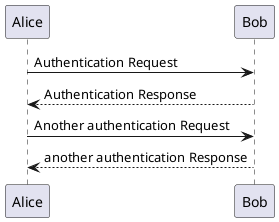

[Qiitaの記事　[memo] IntelliJでMarkdown内のplantumlをPreviewで表示できるようにする](https://qiita.com/nakamasato/items/c454f1b6ca1c3e25f159)

# 具体例
- GitとGithubで管理　ドキュメントの形式はMarkdownで統一

```plantuml
@startuml
Alice -> Bob: Authentication Request
Bob --> Alice: Authentication Response

Alice -> Bob: Another authentication Request
Alice <-- Bob: another authentication Response
@enduml
```