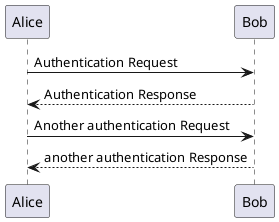

- GitとGithubで管理　ドキュメントの形式はMarkdownで統一
- plant umlでUML図作成

```plantuml
@startuml
Alice -> Bob: Authentication Request
Bob --> Alice: Authentication Response

Alice -> Bob: Another authentication Request
Alice <-- Bob: another authentication Response
@enduml
```

